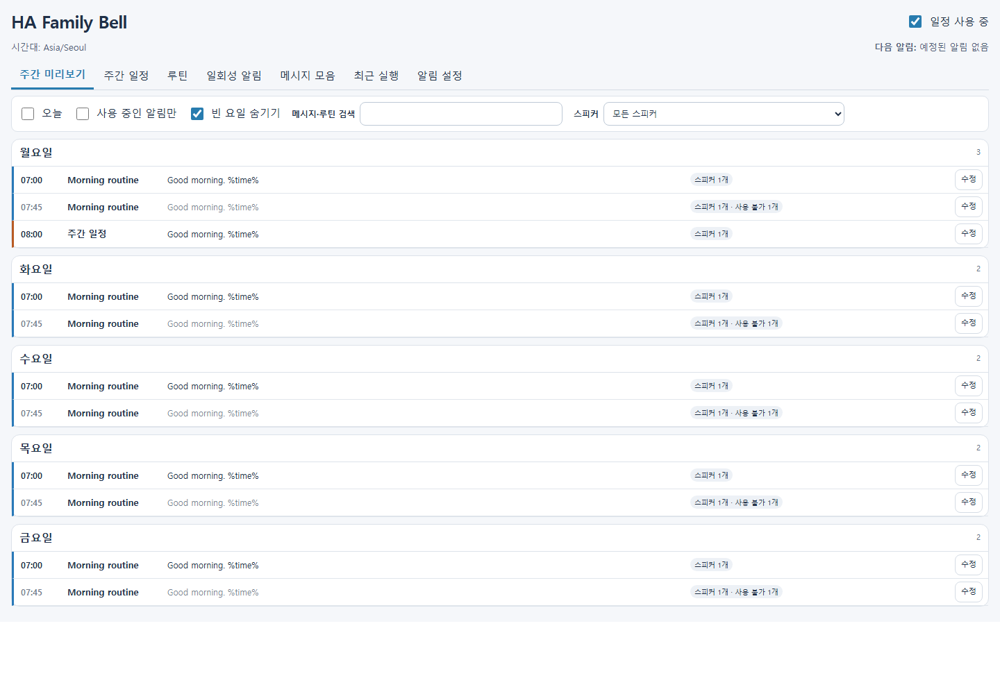

# HA Family Bell

  <picture>
    <source media="(prefers-color-scheme: dark)" srcset="custom_components/ha_family_bell/brand/dark_logo@2x.png">
    
  </picture>

  주간 알림, 루틴, 일회성 안내 방송을 한 화면에서 관리합니다. Schedule spoken reminders and reusable routines in Home Assistant.

  
  
  
  

  

[한국어](#한국어) · [English](#english) · [설치하기](#설치와-첫-사용) · [사용 안내 / User guide](docs/user-guide.md)

예시 일정과 가상의 스피커를 사용한 화면입니다. / Example schedule with fictional speakers.

## 한국어

HA Family Bell은 Home Assistant의 스피커로 정해진 시간에 안내 방송을 재생하는
통합 구성요소입니다. 알림마다 자동화를 만들지 않고 주간 일정, 여러 알림을 묶은
루틴, 일회성 알림을 관리할 수 있습니다.

### 주요 기능

- 많은 알림을 빠르게 훑을 수 있는 간결한 행과 요일별 개수 표시
- 오늘 보기, 검색, 스피커 필터와 빈 요일 숨기기를 제공하는 주간 미리보기
- 별도 편집창, 변경 충돌 안내, 저장 실패 시 초안 유지
- 마지막으로 저장한 스피커를 새 알림에서 자동 선택하는 브라우저별 기본값
- 개별 알림의 사용 설정을 유지하는 루틴 일시 중지와 전체 사용/중지
- Home Assistant 시간대 기준 일회성 알림과 완료된 알림의 명시적 다시 예약
- 반복 없이 순환하는 메시지 모음, %time% 및 %randomset% 자리표시자
- TTS 제공자 선택, 기존 TTS 서비스, 선택적 시작음과 스피커별 대기열
- 전송 결과와 사용 불가 스피커를 보여주는 최근 실행 내역
- 알림, 루틴, 메시지 모음, 알림 설정을 포함하는 JSON 백업 및 복원 미리보기

### 설치와 첫 사용

Home Assistant **2026.7.0 이상**, 관리자 계정, TTS 제공자, TTS를 재생할 수 있는
media_player 엔티티가 필요합니다. Family Bell 자체는 별도 계정이나 API 키가
필요하지 않습니다. 선택한 TTS 제공자는 계정이나 인터넷 연결을 요구할 수 있습니다.

1. 위 HACS 버튼을 누르거나 이 저장소를 HACS의 **Integration** 사용자 지정 저장소로 추가하세요.
2. **HA Family Bell**을 다운로드한 뒤 Home Assistant를 재시작하세요.
3. **설정 → 기기 및 서비스 → 통합 구성요소 추가**에서 **HA Family Bell**을 추가하세요.
4. 사이드바에서 패널을 열고 **알림 설정 → 수정**에서 TTS 제공자와 언어를 확인하세요.
5. 알림을 추가하고 시간, 메시지, 스피커를 선택한 뒤 저장하세요.
6. **저장된 알림 재생**으로 소리를 확인한 후 알림과 전체 일정을 사용 상태로 바꾸세요.

새 일정은 일시 중지 상태로 시작합니다. 새 알림의 사용 체크박스도 기본적으로 꺼져
있습니다. 루틴은 루틴과 개별 알림이 모두 사용 상태여야 실행됩니다.

수동 설치 시 저장소의 custom_components/ha_family_bell 폴더를 Home Assistant
설정 폴더의 custom_components 아래로 복사하고 재시작한 뒤 통합 구성요소를 추가하세요.
이 저장소는 HACS 사용자 지정 저장소로 설치할 수 있습니다.

### v0.4.1로 업데이트

HACS에서 업데이트한 뒤 Home Assistant를 재시작하고 브라우저 패널을 새로고침하세요.
기존 일정, 메시지 모음, TTS 설정과 엔티티의 고유 ID는 유지됩니다. 일정과 미리보기는
더 간결한 행으로 표시됩니다. 알림을 저장하면 선택한 스피커가 해당 브라우저에 기억되어
다음 주간 알림, 일회성 알림, 루틴 알림을 추가할 때 자동으로 선택됩니다. 저장에 실패하거나
편집을 취소하면 기억된 스피커는 바뀌지 않습니다. 브라우저와 기기마다 선택을 따로 기억합니다.

0.3.x에서 업데이트하는 경우 편집은 각 알림의 **수정** 버튼으로 엽니다. 기존 TTS
서비스를 계속 사용할 수 있으며, 제공자를 선택하면 tts.speak를 사용합니다.
완료된 일회성 알림을 수정해도 다시 실행되지 않습니다. 새 미래 시간을 지정하는
**다시 예약**을 사용하세요. 새 복원 기능은 기존 백업의 루틴과 메시지 모음도
복원합니다. 가져온 알림과 루틴은 모두 중지 상태이며, **교체** 모드는 전체 일정도
일시 중지합니다. 0.3.x 백업에는 알림 설정이 없으므로 설정 복원 옵션은 끄세요.

### 동작과 제한

모든 일정은 Home Assistant 시간대를 사용합니다. 서머타임 전환으로 없는 시각의
반복 알림은 그날 건너뛰며, 두 번 오는 시각에는 첫 번째에 한 번만 실행합니다.
일회성 편집에서 없는 시각은 저장할 수 없습니다.

전체 일정 일시 중지, 알림 삭제, 통합 재로드는 대기 중인 실행과 시작음 뒤의 음성
요청을 취소합니다. 이미 스피커에 전달된 오디오는 계속 재생될 수 있습니다.
최근 실행의 **전송됨**은 HA가 요청을 받아들였다는 뜻이며, 실제 소리가 들렸다는
확인은 아닙니다. 플레이어 상태를 참고해 대기열을 유지하되, 상태를 제공하지 않는
스피커에는 길이 추정과 최대 대기 시간을 사용합니다.

기본 유예 시간은 120초입니다. 실행 가능 상태인 일회성 알림은 이 범위 안에서
재시작 후 실행될 수 있습니다. 그보다 오래 지난 알림이나 실행 도중 중단되어 결과가
불확실한 알림은 자동으로 재시도하지 않습니다. **다시 예약**으로 확인 후 실행하세요.

일정과 최근 실행 기록은 Home Assistant에 저장됩니다. 음성으로 읽을 메시지는 선택한
TTS 제공자에 전달될 수 있습니다. 백업에는 메시지, 스피커 ID, 선택한 시작음 경로가
포함되므로 공유 전에 내용을 확인하세요.

[자세한 사용 안내](docs/user-guide.md) · [문제 보고](https://github.com/mahlernim/ha-family-bell/issues) · [기여 안내](CONTRIBUTING.md) · [MIT 라이선스](LICENSE)

## English

HA Family Bell schedules spoken announcements through Home Assistant media players.
Use standalone weekly bells, reusable routines and one-time events without creating
a separate automation for every announcement.

The panel includes compact schedule rows and a combined week preview with Today,
search and speaker filters;
draft-preserving editors with conflict detection; rotating message sets; routine
pause controls that preserve individual selections; modern and legacy TTS support;
per-speaker activity results; and complete backup/restore previews.

### Install and get started

You need **Home Assistant 2026.7.0 or newer**, an administrator account, a configured
TTS provider and media players that can play its speech. Family Bell needs no
separate account or API key. Your TTS provider may need an account or internet access.

1. Use the HACS button above, or add this repository as a custom **Integration** repository.
2. Download **HA Family Bell** and restart Home Assistant.
3. Add **HA Family Bell** under **Settings → Devices & services → Add integration**.
4. Open the sidebar panel. In **Announcement settings → Edit**, choose your TTS provider and language.
5. Add a bell, choose its time, message and speakers, and save.
6. Confirm the audio using **Play saved bell**, then enable the bell and master schedule.

The master schedule and new bell checkboxes start off. A routine and its individual
bells must both be enabled to run. For manual installation, copy
custom_components/ha_family_bell into your configuration's custom_components
directory, restart, and add the integration. HACS installation uses a custom repository.

### Upgrade to v0.4.1

Update in HACS, restart Home Assistant and refresh the panel. Existing schedules,
message sets, announcement settings and entity unique IDs are retained. Schedules
and previews now use compact rows. After a bell is saved, its selected speakers are
remembered in that browser and preselected for new weekly bells, one-time events and
routine steps. Cancelled edits and failed saves do not change the remembered choice.
Each browser or device keeps its own choice.

When upgrading from 0.3.x, open individual **Edit** dialogs to make changes. Existing
legacy TTS services remain supported; choosing a provider uses tts.speak.
Editing a completed one-time event does not replay it. Use **Reschedule** and choose
a new future time. Restore now includes routines and linked message sets from older
backups. Imported bells and routines start disabled; replacing a schedule also
pauses the master switch. Leave **Restore announcement settings** unchecked for
0.3.x backups, which do not contain settings.

### Behavior, privacy and support

All times use Home Assistant's time zone. Recurring bells skip nonexistent
spring-forward times and run only in the first occurrence of a repeated fall-back
time. The one-time editor rejects nonexistent local times.

Pausing, deleting or reloading cancels queued playback and speech waiting behind a
chime. Already accepted audio may continue on a speaker. **Sent** means HA accepted
the request; it does not independently verify audible output. Queue timing uses
player feedback when available, with a duration estimate and bounded timeout when
feedback is unavailable.

Eligible one-time events within the default 120-second grace period may run after
restart. Older events and interrupted attempts with uncertain outcomes are not
automatically retried; review them and use **Reschedule** when appropriate.

Schedules and recent activity are stored in Home Assistant. Messages may be sent to
your chosen TTS provider. Backups include message text, speaker IDs and chime paths;
review their contents before sharing.

See the [user guide](docs/user-guide.md#english) for routines, message sets,
backup restoration and troubleshooting. Report problems in
[GitHub issues](https://github.com/mahlernim/ha-family-bell/issues) in Korean or
English. See [contributing](CONTRIBUTING.md) and the [MIT license](LICENSE).
