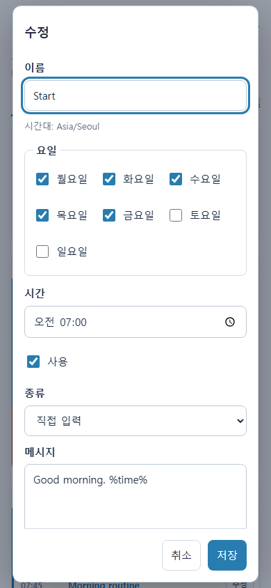

# HA Family Bell 사용 안내

[한국어](#한국어) · [English](#english) · [설치 안내](../README.md)

## 한국어

### 일정 확인과 편집

**주간 미리보기**에서 주간 알림, 루틴과 앞으로 7일 안의 일회성 알림을 함께
확인하세요. **오늘**, **사용 중인 알림만**, **빈 요일 숨기기**, 메시지 검색,
스피커 필터를 조합할 수 있습니다. 같은 시간에 같은 스피커를 사용하는 활성 알림에는
스피커 겹침 표시가 나타납니다. 중지된 알림은 겹침 계산에서 제외됩니다. 간결한 행과
요일별 개수 표시를 사용해 많은 알림을 한 화면에서 확인할 수 있습니다.

반복 알림끼리의 겹침은 오늘 해당 시각이 지났어도 표시합니다. 일회성 알림과의 겹침은
미리보기에 표시하는 7일의 실제 날짜를 기준으로 계산합니다. 겹침 표시는 같은 시각에
대기열을 공유할 수 있다는 안내이며, 실행을 차단하지 않습니다.

모바일에서는 사용 체크박스와 **수정**을 바로 사용하세요. 재생, 복사, 다시 예약,
삭제는 해당 행의 **더 보기**에서 선택합니다. 스피커 요약에 전체 개수와 사용 불가
상태를 표시하며, 전체 목록은 **수정**에서 확인할 수 있습니다.

각 행의 **수정**은 해당 알림을 바로 엽니다. 다른 화면에서 상태가 바뀌어도 편집 중인
내용은 유지됩니다. 같은 알림을 다른 관리자가 먼저 저장했다면 변경 안내가 표시되고
오래된 내용의 저장을 거부합니다. 필요한 초안을 따로 보관한 뒤 **저장된 내용 불러오기**를
선택하세요. 저장 오류가 나면 편집창 안의 오류를 확인하고 다시 시도하세요.

삭제할 항목이 다른 화면에서 변경되었다면 삭제를 거부합니다. 최신 내용을 확인한 뒤
다시 삭제하세요. 새 알림의 **사용**은 기본적으로 꺼져 있으며, 직접 체크한 경우에는
**추가**를 누를 때 사용 상태로 저장합니다. 가져오기와 요일별 복사는 중지 상태로 만듭니다.

알림을 저장하면 선택한 스피커가 현재 브라우저에 기억됩니다. 새 주간 알림,
일회성 알림, 루틴 알림을 만들 때 해당 스피커가 자동으로 선택됩니다. 편집을 취소하거나
저장에 실패하면 기억된 선택은 바뀌지 않습니다. 다른 브라우저나 기기에서는 처음 한 번
스피커를 선택해 저장해야 합니다.

### 루틴과 메시지

루틴을 만들고 원하는 요일과 시각의 알림을 추가하세요. 루틴을 중지해도 개별 알림의
체크 상태는 유지됩니다. **모두 사용/모두 중지**는 해당 루틴의 개별 알림 설정을 바꿉니다.
**주간 알림을 루틴으로 묶기**에서 대상 알림을 선택하고 변환 결과를 확인한 뒤 적용할
수 있습니다. 적용하면 선택한 독립 알림을 제안된 루틴으로 교체합니다.

직접 입력 메시지에서는 %time%를 현재 HA 현지 시각으로 바꿉니다.
메시지 모음을 연결할 때는 %randomset%를 넣으세요. 예:

    지금은 %time%입니다. %randomset%

활성 메시지를 한 차례씩 사용한 후 새 순서를 만들며, 두 개 이상일 때는 순환 경계에서도
같은 메시지를 연속 선택하지 않습니다. **저장된 알림 재생**은 순환 순서를 소모하지
않습니다. 메시지 모음은 연결된 알림이 있는 동안 삭제할 수 없습니다.
고급 사용자는 Home Assistant Jinja 템플릿도 사용할 수 있습니다.

### TTS와 실행 결과

처음 설치할 때 사용 가능한 TTS 엔티티를 선택하고, 다음 화면에서 해당 제공자가 지원하는
언어를 선택하세요. HA의 표시 언어를 음성 언어로 자동 적용하지 않습니다. 제공자가
없거나 설정 도중 사용할 수 없게 되면 제공자를 설정한 뒤 다시 선택하세요. 설정 중에는
음성을 재생하지 않으며 새 일정은 일시 중지 상태로 시작합니다.

통합 구성요소를 삭제했다가 다시 추가할 때 저장된 데이터가 남아 있으면 기존 데이터를
사용할지 확인합니다. 기존 일정과 음성 설정을 유지하며, 사용 중이던 일정은 다시 실행됩니다.

**알림 설정 → 수정**에서 TTS 엔티티를 선택하면 tts.speak로 요청합니다.
기존 TTS 서비스 옵션은 tts.google_translate_say 같은 설정을 유지할 때 사용합니다.
언어를 비워 두면 제공자의 기본 언어를 사용합니다. 제공자에 맞는 언어 코드를 선택하세요.
[Home Assistant TTS 안내](https://www.home-assistant.io/integrations/tts/)에서 제공자와
스피커 설정을 확인할 수 있습니다.

시작음은 줄마다 하나의 미디어 경로나 URL을 입력하세요. 여러 줄이면 무작위로 선택하고,
비우면 시작음을 사용하지 않습니다. 반복 알림의 TTS 캐시는 기본적으로 켜져 있습니다.
테스트와 일회성 알림은 캐시를 요청하지 않습니다.

최근 실행에는 대기 중/전송 중, 전송됨/일부 전송됨/실패/취소됨 상태와 스피커별 결과가
표시됩니다. 스피커로 이미 전송한 오디오는 전체 일정을 중지해도 멈추지 않을 수 있습니다.
기본 최대 재생 대기 시간은 180초입니다. 스피커가 재생 상태를 전달하지 않는 경우
문구 길이로 시간을 추정하므로 긴 음성이나 다른 미디어와의 완벽한 동기화를 보장하지 않습니다.

일회성 알림을 실행 중에 수정해도 이미 시도한 예약을 자동으로 다시 실행하지 않습니다.
새 미래 시각으로 명시적으로 변경한 예약은 유지됩니다. 취소된 실행과 스피커 전송 결과는
최근 실행에서 확인하세요. 전송 요청의 완료는 실제 소리가 들렸다는 확인이 아닙니다.

HA 시간대를 바꾸면 반복 알림은 현지 시각을 유지하고 일회성 알림은 원래의 예약 순간을
유지합니다. 대기 중인 일회성 알림의 표시 시각이 달라지면 알림을 표시합니다. 알림의
패널 링크에서 새 현지 시각을 확인하고 필요한 경우 다시 예약하세요.

### 백업과 복원

1. **알림 설정 → 백업 다운로드**로 현재 데이터를 저장하세요.
2. **백업 복원**에서 JSON 파일을 선택하세요.
3. **기존 일정에 추가** 또는 **기존 일정 교체**를 선택하세요.
4. 필요하면 **알림 설정도 복원**을 체크하고 **복원 미리보기**를 누르세요.
5. 표시된 개수와 모드를 확인한 뒤 **중지 상태로 복원**을 선택하세요.
6. 스피커와 TTS 설정을 확인하고 필요한 루틴과 개별 알림을 사용 상태로 바꾸세요.

추가는 현재 항목을 유지하면서 새 ID를 가진 복사본을 만들고 메시지 모음 연결도 옮깁니다.
교체는 현재 일정과 메시지 모음을 대체하고 전체 일정을 일시 중지합니다.
복원된 루틴과 모든 개별 알림은 중지 상태입니다. 기존 항목을 덮어쓰는 ID 충돌은 없습니다.

백업에는 전체 사용 스위치, 실행 기록, 무작위 선택 진행 상태가 포함되지 않습니다.
이전 백업도 일정 복원에 사용할 수 있지만 알림 설정이 없으면 설정 복원 옵션을 끄세요.
HA와 다른 시간대의 백업은 시간 변환 후 가져와야 하며, 그대로 복원하면 오류를 표시합니다.
파일은 5 MB 이하여야 합니다. 미리보기 이후 일정이 변경되면 다시 미리보기를 해야 합니다.

### 문제 해결

- **알림이 실행되지 않음:** 전체 일정, 루틴, 개별 알림의 사용 상태와 HA 시간대를 확인하세요.
- **전송됐지만 소리가 없음:** 스피커 상태와 TTS 제공자, 언어 코드, 스피커가 미디어 URL에
  접근할 수 있는지 확인하세요. 저장된 알림 재생은 실제 오디오를 요청합니다.
- **완료/지나감 일회성 알림:** 편집만으로 다시 실행되지 않습니다. 새 미래 시간으로 다시 예약하세요.
- **재로드/재시작 중 중단:** 결과를 확정할 수 없는 일회성 시도는 자동 재생하지 않습니다.
  최근 실행, 스피커와 HA 로그를 확인하고 필요한 경우 다시 예약하세요.
- **패널이 예전 모습:** 업데이트 후 HA를 재시작하고 브라우저를 새로고침하세요.

문제를 보고할 때 통합 버전, HA 버전, 오류 문구와 재현 순서를 알려주세요.
실제 메시지나 백업을 공개 이슈에 그대로 첨부하지 마세요.

## English

### Review and edit schedules

**Week preview** combines recurring bells and one-time events in the next seven
days. Combine Today, Enabled only, Hide empty days, search and speaker filters.
Shared-speaker warnings apply to enabled bells scheduled for the same minute.
Paused bells do not create conflict warnings. Compact rows and per-day counts keep
larger schedules scannable.

Recurring overlaps remain visible after their time has passed today. Overlaps with
one-time events use actual dates within the seven displayed days. Warnings indicate
possible shared queues and do not block execution.

On mobile, use the enable checkbox and **Edit** directly. Open the row's **More**
menu for playback, copy, reschedule and delete actions. Speaker summaries retain
the total and unavailable status. Open **Edit** to inspect the complete list.

**Edit** opens the exact bell or routine step. Background updates preserve the
draft. If someone else changes the same record, save is rejected with a conflict
message. Keep any draft text you need, then choose **Reload saved version**.
Save errors stay in the dialog so you can correct the problem and try again.

Deletion is rejected if the record changed in another window. Review its current
contents before deleting again. New bells default to disabled, but explicitly
checking **Enabled** makes **Create** save an enabled bell. Imports and copies to
other days start disabled.

After a bell is saved, its selected speakers are remembered in the current browser.
They are preselected when creating a weekly bell, one-time event or routine step.
Cancelling an edit or encountering a failed save does not change the remembered
choice. Each browser or device remembers its own selection.

### Routines and messages

Create a routine and add bells with weekdays, a time and speakers. Pausing the
routine preserves individual enabled selections; **All on/All off** changes those
selections. **Convert weekly bells to a routine** previews a proposed routine
before replacing the selected standalone bells.

Use %time% for Home Assistant's local time. For a linked message set, include
%randomset%, for example:

    It is %time%. %randomset%

Enabled variants cycle without repeats. With at least two variants, the first
message of a new cycle also differs from the previous one. **Play saved bell**
does not consume the rotation. A message set cannot be deleted while bells still
reference it. Advanced Home Assistant Jinja templates are supported.

### TTS, chimes and activity

On first installation, choose an available TTS entity, then select one of its
supported languages. HA's display language is not automatically used as the speech
language. If no provider is available or it becomes unavailable during setup,
configure it and choose again. Setup does not play audio, and new schedules start paused.

When removing and re-adding the integration, any retained data is offered for reuse.
Existing schedules and speech settings are preserved, and previously enabled
schedules resume.

Choose a TTS entity in **Announcement settings → Edit** to use tts.speak.
The legacy service option retains services such as tts.google_translate_say.
Leave language empty to use the provider's default; otherwise use a language code
supported by that provider. See the
[Home Assistant TTS documentation](https://www.home-assistant.io/integrations/tts/).

Enter one chime media path or URL per line. Multiple entries are selected at
random; an empty list disables chimes. Recurring TTS caching is enabled by default.
Manual tests and one-time events request uncached speech.

Recent activity shows queued/sending jobs and sent, partially sent, failed or
cancelled outcomes per speaker. Accepted audio may continue after pausing.
The default maximum playback wait is 180 seconds. Without usable player feedback,
wait time is estimated from text length; long announcements or unrelated media
cannot be synchronized perfectly.

Editing a one-time event during execution does not automatically retry the attempted
occurrence. Explicitly changing it to a new future time preserves that new occurrence.
Check Recent activity for cancellation and per-speaker results. A completed service
request does not prove that audio was heard.

Changing HA's time zone preserves recurring wall times and the original instant of
one-time events. A notification appears if pending one-time events acquire different
local times. Follow its panel link, review those times, and reschedule if necessary.

### Backup and restore

1. In **Announcement settings**, choose **Download backup**.
2. Choose **Restore backup** and select a JSON file.
3. Choose **Add to current schedule** or **Replace current schedule**.
4. Optionally select **Restore announcement settings**, then **Preview restore**.
5. Review the counts and mode, then choose **Restore disabled**.
6. Check TTS and speaker settings, then enable the desired routines and individual bells.

Merge creates new IDs and remaps message-set links while preserving existing
records. Replace removes the current schedule and message sets and pauses the
master switch. Imported routines and all their bells start disabled.

Backups do not include the master switch, history or shuffle progress. Older
backups support schedule restoration; leave settings restoration unchecked if
settings are absent. A backup from a different time zone must have its times
converted before import. Files must be below 5 MB. If schedules change after
preview, preview again before applying.

### Troubleshooting

- **No scheduled audio:** Check the master, routine and individual bell switches
  and Home Assistant's time zone.
- **Sent but silent:** Check speaker availability, TTS provider, language and
  media URL reachability. Play saved bell requests real audio.
- **Completed/missed one-time event:** Editing does not replay it. Use
  Reschedule with a new future time.
- **Interrupted restart/reload:** A one-time attempt with an uncertain outcome
  is not replayed automatically. Check activity, speakers and HA logs before rescheduling.
- **Old panel after an update:** Restart Home Assistant and refresh the browser.

Report the integration version, HA version, error text and reproduction steps.
Remove personal messages and backup contents before posting a public issue.
